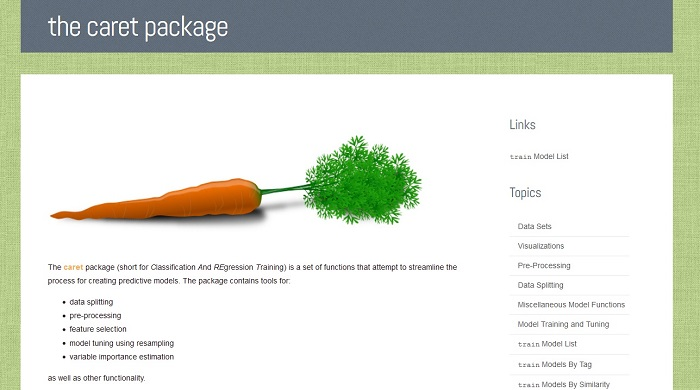

Detta är råmanus till en dragning jag höll på Pensionsmyndigheten i oktober 2014. Originalet finns i Markdown-form [här](https://github.com/LCHansson/LCHansson.github.io/blob/master/_knitr/2014-10-28-R-och-Analytics.Rmd) och en HTML-variant finns [här]({{site.url}}/assets/html/2014-10-28-R-och-Analytics.html)

# Trender

## Databearbetning

Allt kortare tid till modell + visualisering. Allt mer data samlas och analyseras i tabellform, t.ex. `data.frame()`/`data.table()`.

- `dplyr`: kraftigt förkortad tid för ett flertal databearbetningsutmaningar
- `ggvis`: förenklad interaktiv visualisering
- `tidyr`: underlättad omstrukturering av data

## Modellering

Det stora utvecklingsområdet de kommande åren. Metoder för både enkel och avancerad modellering blir allt mer lättilgängliga

- Maskininlärning på stark frammarsch
- Automatisering av en stor mängd enklare dataanalysuppgifter
- Ickeparametrisk statistik
- `caret`: En frontend för ett mycket stort antal modelleringspaket i R

## Exemplet `caret`

`caret` är ett paket för att mcyket snabbt preparera data för modellering och mycket snabbt tillämpa en enorm uppsättning analysmetoder (t.ex. GLM, Random Forest, neurala nätverk, etc.). Resultaten är direkt jämförbara, även om de underliggande modellerna är extremt olika. __Detta arbetssätt är utan tvekan framtiden för analytiskt arbete__!

## Publicering

Den ökade tillgången på lättanvända programmeringsspråk och ökade programmeringskunskaper gör att grundläggande kunskaper om statistik och/eller programmering inte längre är en framgångsfaktor. "Alla är analytiker" håller på att bli ett ledord.

WYSIWYG-verktyg och closed source tappar mark som plattformar för dataanalys. SPSS och SAS ger stadigt vika för R, Julia och Python.

## Open data

Open data ökar starkt i tillgänglighet. Flera vägar finns för att samla in data från öppna datakällor, t.ex. flera R-paket.

- `pxweb` (SCB, m.fl. myndigheter)
- `ROpenSci`
- `Quandl`
- och många, många mer...

## Big Data

Fler alternativ allt mer tillgängliga och lättanvända.

- Julia
- Revolution R Open
- Spark (ersätter Hadoop)

## Verktygen

Statistisk programmering genomgår just nu en stor utveckling. Dessa är någa exempel på områden där helt nya tekniker utvecklats under de senaste 1-2 åren:

- Visualisering: `shiny`
- Big data: The Julia language
- Modellering: `caret`
- Databearbetning: "Hadleyverse"-paketen `dplyr`, `ggvis`, `tidyr`

# Framtidsspaningar

## Horisonten

Teamet bakom RStudio är den drivande motorn för det verkligt innovativa i R-världen just nu.

De och Julia-teamet står uppskattningsvis för 80-90% av den uppmärksamhet som riktats mot statistik programmering de senaste åren.

## Förväntningar på framtiden

- Programmering som literacy 2.0
- Allt fler blir analytiker. Detta ställer krav på 
- Smarta automater tar över enklare modell- och analysuppgifter
- Onlinepublicering (webb) istället för statisk publicering (trycksaker, Word-dokument)
- Visualisering blir piecemeal
- Ingen vet vad som händer när RStudio tappar ledarpinnen. Revo-R? Julia? Python? JavaScript? IBM?

# Inspiration

## Vidare läsning

- Jens Finnäs: [Spaningar om framtiden för datajournalistik](http://jplusplus.se/14-spaningar-om-datajournalistik/)
- Bob Muenchen: [Användningstrender för olika statistikmjukvaror](http://r4stats.com/articles/popularity/)
- C.G.P. Grey: [Humans Need Not Apply (youtube)](https://www.youtube.com/watch?v=7Pq-S557XQU&list=UU2C_jShtL725hvbm1arSV9w)

# Tack!

http://lchansson.com/R-och-Analytics/
love.hansson@gmail.com
